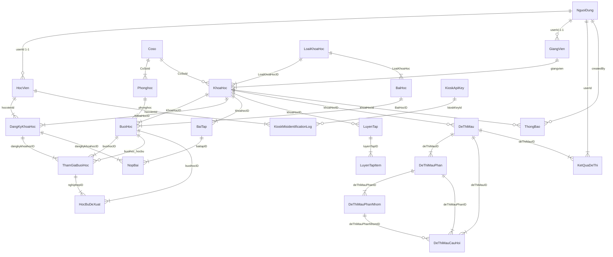

# Sơ đồ thực thể liên kết (ERD) — đồng bộ với `server/models`

Tài liệu mô tả **các liên kết ObjectId** (và tham chiếu nhúng trong sub-document) theo schema Mongoose hiện tại. Hình vẽ dùng **Mermaid** — xem trực tiếp trong VS Code / GitHub / export PDF từ preview.

**Ghi chú đặc biệt**

- **KhoaHoc.lichHoc**: mảng sub-document, mỗi phần tử có trường `phonghoc` → **Phonghoc** (không phải trường top-level của `KhoaHoc`).
- **KetQuaDeThi.chiTiet[]**: sub-document có `cauHoiId` → **DeThiMauCauHoi** (logic snapshot; không khai báo `ref` trong schema nhưng vẫn là liên kết nghiệp vụ).

---

## Hình 1 — Toàn hệ (flowchart, nhóm theo miền)

```mermaid
flowchart TB
  subgraph Identity["Tài khoản & vai trò"]
    NguoiDung["NguoiDung"]
    HocVien["HocVien"]
    GiangVien["GiangVien"]
  end

  subgraph Facility["Cơ sở & phòng"]
    Coso["Coso"]
    Phonghoc["Phonghoc"]
  end

  subgraph CourseDomain["Khóa học & nội dung"]
    LoaiKhoaHoc["LoaiKhoaHoc"]
    KhoaHoc["KhoaHoc"]
    BaiHoc["BaiHoc"]
    BuoiHoc["BuoiHoc"]
    DangKyKhoaHoc["DangKyKhoaHoc"]
    ThamGiaBuoiHoc["ThamGiaBuoiHoc"]
    HocBuDeXuat["HocBuDeXuat"]
  end

  subgraph AssignPractice["Bài tập & luyện tập"]
    BaiTap["BaiTap"]
    NopBai["NopBai"]
    LuyenTap["LuyenTap"]
    LuyenTapItem["LuyenTapItem"]
  end

  subgraph Exam["Đề thi mẫu & kết quả"]
    DeThiMau["DeThiMau"]
    DeThiMauPhan["DeThiMauPhan"]
    DeThiMauPhanNhom["DeThiMauPhanNhom"]
    DeThiMauCauHoi["DeThiMauCauHoi"]
    KetQuaDeThi["KetQuaDeThi"]
  end

  subgraph MediaNotify["File & thông báo"]
    File["File"]
    ThongBao["ThongBao"]
  end

  subgraph Kiosk["Kiosk điểm danh"]
    KioskApiKey["KioskApiKey"]
    KioskMisidentificationLog["KioskMisidentificationLog"]
  end

  HocVien -->|"userId"| NguoiDung
  GiangVien -->|"userId"| NguoiDung

  Phonghoc -->|"CoSoId"| Coso

  KhoaHoc -->|"LoaiKhoaHocID"| LoaiKhoaHoc
  KhoaHoc -->|"CoSoId?"| Coso
  KhoaHoc -->|"giangvien"| GiangVien
  KhoaHoc -.->|"lichHoc[].phonghoc"| Phonghoc

  BaiHoc -->|"LoaiKhoaHoc"| LoaiKhoaHoc
  BaiHoc -->|"file?"| File
  BaiHoc -->|"files[]"| File

  BuoiHoc -->|"KhoaHocID"| KhoaHoc
  BuoiHoc -->|"BaiHocID"| BaiHoc
  BuoiHoc -->|"phonghoc"| Phonghoc

  DangKyKhoaHoc -->|"hocvienId"| HocVien
  DangKyKhoaHoc -->|"KhoaHocID"| KhoaHoc

  ThamGiaBuoiHoc -->|"dangkykhoahocID"| DangKyKhoaHoc
  ThamGiaBuoiHoc -->|"buoihocID"| BuoiHoc
  ThamGiaBuoiHoc -->|"buoihoc_hocbu?"| BuoiHoc

  HocBuDeXuat -->|"nghiphepID"| ThamGiaBuoiHoc
  HocBuDeXuat -->|"buoihocID"| BuoiHoc

  BaiTap -->|"khoahocID"| KhoaHoc
  BaiTap -->|"file?"| File

  NopBai -->|"baitapID"| BaiTap
  NopBai -->|"dangkykhoahocID"| DangKyKhoaHoc
  NopBai -->|"filenop?"| File
  NopBai -->|"filedapan[]"| File

  LuyenTap -->|"khoaHocID?"| KhoaHoc
  LuyenTapItem -->|"luyenTapID"| LuyenTap

  DeThiMau -->|"khoaHocID?"| KhoaHoc
  DeThiMauPhan -->|"deThiMauID"| DeThiMau
  DeThiMauPhanNhom -->|"deThiMauPhanID"| DeThiMauPhan
  DeThiMauPhanNhom -->|"files[]"| File
  DeThiMauCauHoi -->|"deThiMauID"| DeThiMau
  DeThiMauCauHoi -->|"deThiMauPhanID"| DeThiMauPhan
  DeThiMauCauHoi -->|"deThiMauPhanNhomID?"| DeThiMauPhanNhom
  DeThiMauCauHoi -->|"files[]"| File

  KetQuaDeThi -->|"userId"| NguoiDung
  KetQuaDeThi -->|"deThiMauID"| DeThiMau
  KetQuaDeThi -.->|"chiTiet[].cauHoiId"| DeThiMauCauHoi

  ThongBao -->|"createdBy?"| NguoiDung
  ThongBao -->|"createdByAdminId?"| NguoiDung
  ThongBao -->|"khoaHocId?"| KhoaHoc
  ThongBao -->|"userID[]"| NguoiDung
  ThongBao -->|"readByUserIds[]"| NguoiDung
  ThongBao -->|"fileIds[]"| File

  KioskMisidentificationLog -->|"hocvienId"| HocVien
  KioskMisidentificationLog -->|"kioskKeyId?"| KioskApiKey
```

Ký hiệu: `?` = trường tùy chọn (optional) trong schema. Đường nét đứt (`.->`) = liên kết nhúng / logic, không phải `ref` trực tiếp ở cấp document.

---

## Hình 2 — Ký hiệu ER cổ điển (Mermaid `erDiagram`)

Phù hợp chèn vào báo cáo khi cần bảng cardinality rút gọn.

Các tham chiếu **File** (đa hướng) không vẽ hết trong `erDiagram` để tránh rối; xem **Hình 1**.

---

## Danh sách collection (theo model)

| Collection | Liên kết chính (ref / logic) |
|------------|------------------------------|
| NguoiDung | — |
| HocVien | → NguoiDung |
| GiangVien | → NguoiDung |
| Coso | — |
| Phonghoc | → Coso |
| LoaiKhoaHoc | — |
| KhoaHoc | → Coso?, LoaiKhoaHoc, GiangVien; lịch: → Phonghoc |
| BaiHoc | → LoaiKhoaHoc; → File?, File[] |
| BuoiHoc | → KhoaHoc, BaiHoc, Phonghoc |
| DangKyKhoaHoc | → HocVien, KhoaHoc |
| ThamGiaBuoiHoc | → DangKyKhoaHoc, BuoiHoc; → BuoiHoc? (học bù) |
| HocBuDeXuat | → ThamGiaBuoiHoc, BuoiHoc |
| BaiTap | → KhoaHoc; → File? |
| NopBai | → BaiTap, DangKyKhoaHoc; → File?, File[] |
| LuyenTap | → KhoaHoc? |
| LuyenTapItem | → LuyenTap |
| DeThiMau | → KhoaHoc? |
| DeThiMauPhan | → DeThiMau |
| DeThiMauPhanNhom | → DeThiMauPhan; → File[] |
| DeThiMauCauHoi | → DeThiMau, DeThiMauPhan; → DeThiMauPhanNhom?; → File[] |
| KetQuaDeThi | → NguoiDung, DeThiMau; chiTiet.cauHoiId → DeThiMauCauHoi |
| File | Được tham chiếu bởi nhiều collection |
| ThongBao | → NguoiDung (nhiều vai trò), KhoaHoc?; → File[] |
| KioskApiKey | — |
| KioskMisidentificationLog | → HocVien, KioskApiKey? |

---

*Tạo / cập nhật: đồng bộ với các file trong `server/models` có khai báo `ref` và sub-document tương ứng.*
